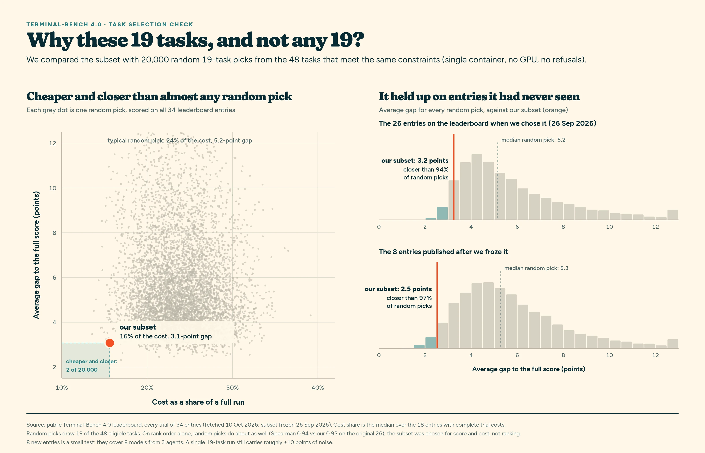
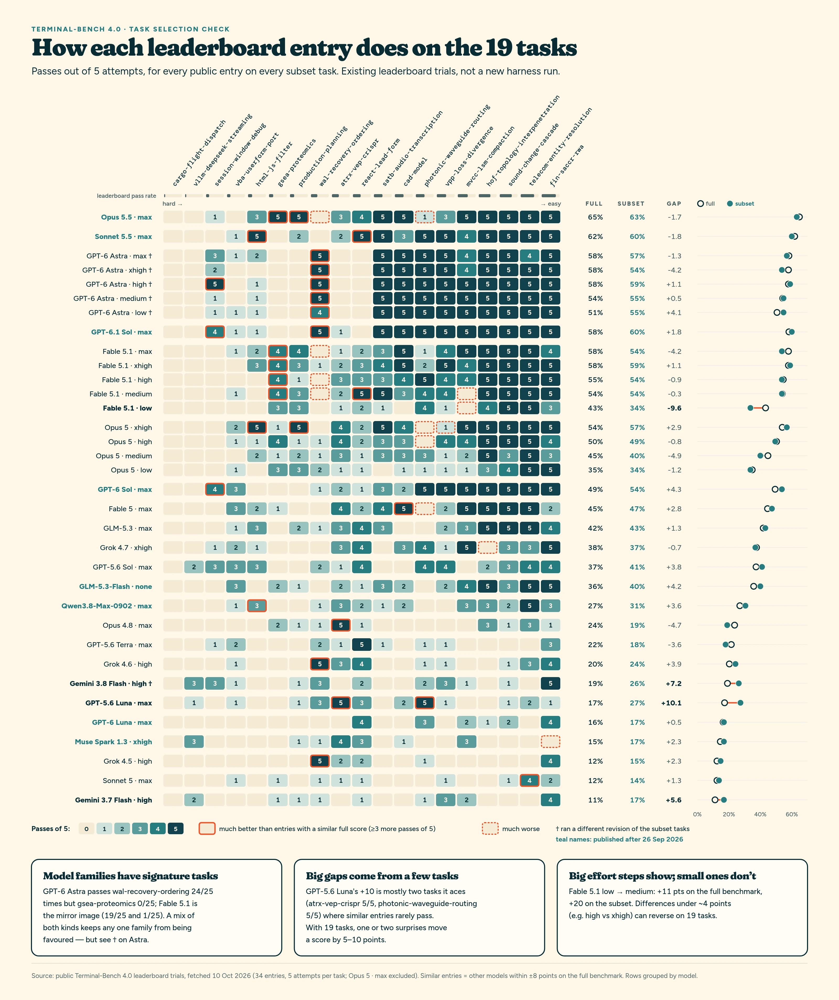
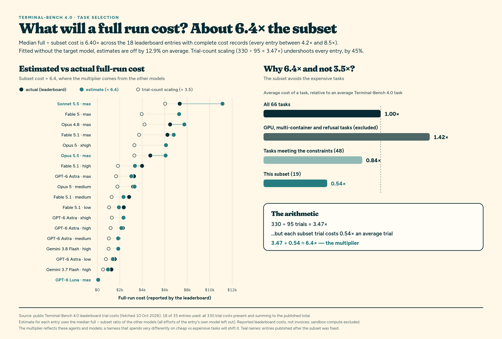

# Terminal-Bench 4 subset

We want to test harness and model combinations often, cheaply and in a way that
reflects the full benchmark. A full [Terminal-Bench 4.0](https://hub.harborframework.com/datasets/terminal-bench/terminal-bench/leaderboards/4-0-0)
run is 66 tasks × 5 attempts, 330 trials, and usually costs thousands of dollars. That's
too expensive to repeat for every harness change or new model.

We run 19 of the 66 tasks, five attempts each: 95 trials for about 16% of the cost
of a full run. This page explains how the tasks were chosen and how closely their score
follows the full benchmark.

The comparisons below use the public leaderboard's own trials: each entry is re-scored
on just our 19 tasks and compared with its published full score. None of them is a
fast-agent run.

## How the tasks were chosen

Every trial runs as a single container on [HF Jobs](https://huggingface.co/docs/hub/jobs),
without a GPU. Three rules take the 66 tasks down to 48:

| Rule | Tasks excluded |
| --- | --- |
| **Single container**: no docker-compose sidecar | ctr-optimization, cumulative-layout-shift, freight-dispatch-shift, heat-pump-warranty, intrastat-meldung, kv-live-surgery, legacy-utility-triage, live-database-cutover, medical-claims-processing, nextjs-performance, payments-pipeline-fix |
| **No GPU** | fp8-rmsnorm-gemm, jax-speedrun-gpu, math-eval-grader |
| **No safety refusals**: no leaderboard trial had ended in a model refusal | batched-eval-parity, interleaved-vigenere, kv-live-surgery, shadow-relay, uefi-bootkit |

From those 48 we picked tasks that, together, score close to the full benchmark and are
cheap to run. Four candidates (distributed-dedup, ks-solver-cpp, vf2-speedup-networkx,
embedding-drift-monitor) were rejected because their verifiers have open defect reports.
The subset was fixed on 26 September 2026, pinned to the task revisions the leaderboard
ran.

It is likely that the task list will be expanded with Terminal-Bench 4.1 and 5.

The 19 tasks: atrx-vep-crispr, cad-model, cargo-flight-dispatch, fin-saccr-rwa,
gsea-proteomics, hof-topology-interpenetration, html-js-filter, mvcc-lsm-compaction,
photonic-waveguide-routing, production-planning, react-lead-form,
satb-audio-transcription, session-window-debug, sound-change-cascade,
telecom-entity-resolution, vba-userform-port, vllm-deepseek-streaming,
vpp-loss-divergence and wal-recovery-ordering.

## Does it track the full score?

Loading chart…

Across 34 leaderboard entries, the subset score is on average 3.1 points from the full
score, and 30 of the 34 are within 5 points. It puts the entries in nearly the same
order (rank correlation 0.96). Compared only with the other 47 tasks, so that no trials
are shared, the average gap is 4.3 points.

The teal entries were published after we fixed the subset, so they had no influence on
which tasks we chose. All 8 are within 5 points, with an average gap of 2.5.

Opus 5 · max is left out: its trial records (173 passes) don't reproduce its published
score (171).

## Is it better than any 19 tasks?

<figure class="fa-figure">
  
  <figcaption>Our subset compared with 20,000 random picks of 19 tasks from the same 48.</figcaption>
</figure>

A typical random pick of 19 eligible tasks costs about 24% of a full run and is 5.2
points from the full score. Ours costs 16% and is 3.1 points away. Only 2 of 20,000
random picks were both cheaper and closer.

That held for the entries published later: on those 8, our subset was closer than 97%
of random picks. On rank order alone, random picks do about as well; the subset was
chosen for score and cost, not ranking.

## Entry by entry

<figure class="fa-figure">
  
  <figcaption>Passes out of 5 for every leaderboard entry on every subset task, hardest tasks on the left.</figcaption>
</figure>

The tasks range from one no entry has passed (`cargo-flight-dispatch`) to ones most
entries pass. The large gaps come from a few tasks: GPT-5.6 Luna scores 10 points
higher on the subset mostly because it passes two tasks that entries with similar full
scores rarely do.

## Estimating the cost of a full run

<figure class="fa-figure">
  
  <figcaption>Subset cost × 6.4 against each entry's published full-run cost.</figcaption>
</figure>

On the 18 entries with complete cost records, a full run costs a median 6.4 times the
subset, not the 3.5 times you'd expect from the trial count, because the subset leaves
out the most expensive tasks. Scaling by trial count underestimates every entry, by 45%
on average.

Estimated from the other models' entries, the multiplier is off by 13% on average, and
can be much further out: for Sonnet 5.5 it's 52% too high, because that model spends
more than usual on the subset's tasks.

## Limits

- **One run is noisy.** With 19 tasks, a single run's score can move by around 10
  points. Treat smaller differences between two configurations as unresolved.
- **It's a stand-in.** We use it to compare harnesses and models and to catch
  regressions. A published leaderboard score still needs a full run.
- **Chosen with the leaderboard in view.** The 26 entries available on 26 September
  flatter the subset; only 8 have arrived since. They're a good sign, but a small sample.
- **Entries share models.** The 34 entries cover 23 models, so they aren't independent.
- **The range is slightly compressed.** On the weakest third of entries the subset reads
  2.6 points high on average; on the strongest third, 0.6 points low.
- **Task revisions.** Six entries (GPT-6 Astra × 5 and Gemini 3.8 Flash) ran an earlier
  revision of the subset tasks than the rest.
- **Refusals since we chose the tasks.** Opus 5.5 and Sonnet 5.5 have each refused once
  on a subset task (atrx-vep-crispr and session-window-debug). We've kept both tasks:
  the subset was fixed on 26 September, and a refusal counts as a failed attempt like
  any other.
  Our own Claude runs have hit provider safety stops too: Opus 5.5 · high on every
  attempt at atrx-vep-crispr and html-js-filter, and Haiku 5.5 on 4 of 5 atrx-vep-crispr
  attempts at both efforts.

## Our runs

Our TB4 runs are fast-agent cohorts run with bench-run on HF Jobs: the 19 subset tasks
only, five attempts each, at each task's native deadline (no timeout override), with no
whole-trial retries. Trials that failed for infrastructure reasons (a sandbox error, a
rejected first request) are rerun as replacements, and the originals are kept as
evidence. Every trial is in the public
[published-benchmarks bucket](https://huggingface.co/buckets/evalstate/published-benchmarks/tree/tb4/19-task-v1),
with the bench-run release manifest that fixes the trial set.

- **Hardware.** HF Jobs matches each task's CPU and memory request to a hardware
  flavour with at least that capacity; the limits aren't strictly enforced.
- **Images.** The frozen hof-topology-interpenetration image is amd64-only.
- **Subset only.** Our runs have no full 66-task score; leaderboard rows are cut to the
  same 19 tasks for comparison.

## Costs on the page

Leaderboard rows show the sum of their recorded trial costs on the 19 tasks; where a
task has a trial without a recorded cost, the figure is marked **~**. Our subset runs
show Harbor's recorded token cost at list rates, or a list-rate repricing where the
recorded cost priced prompt-cache writes wrongly; runs through GitHub Copilot show a
list-price equivalent, not what Copilot billed. Each comparator's run page also shows its
full 66-task run and published cost.
