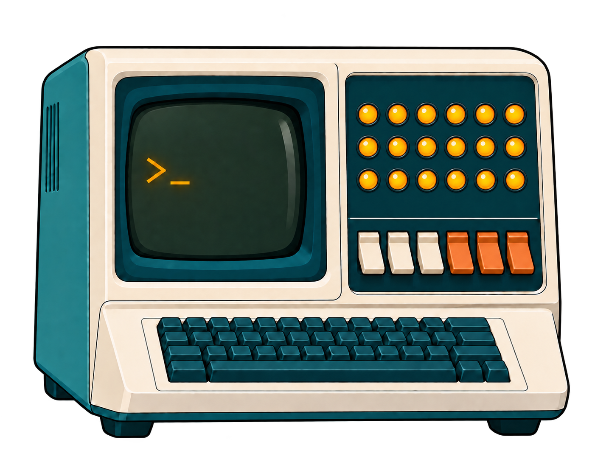

<header class="fa-editorial-intro fa-brand-splash">
  <h1 aria-label="fast-agent">fast- agent</h1>
  
The harness your model deserves.<i aria-hidden="true"></i>

</header>

<section class="fa-campaign" aria-label="Accuracy and efficiency">
  <a class="fa-atomic-campaign" href="benchmarks/" aria-label="View fast-agent accuracy and efficiency benchmarks">
    
<svg class="fa-board-chart" viewBox="0 0 120 100" aria-hidden="true" focusable="false"><path d="M14 10V86H112" fill="none" stroke="#082C34" stroke-width="3" stroke-linecap="round"/><g fill="#277C80" opacity=".5"><circle cx="40" cy="72" r="4"/><circle cx="63" cy="66" r="4"/><circle cx="80" cy="48" r="4"/><circle cx="98" cy="57" r="4"/></g><path d="M26 65Q39 36 56 27T104 14" fill="none" stroke="#F45125" stroke-width="4" stroke-linecap="round"/><g fill="#FFB52E" stroke="#082C34" stroke-width="2"><circle cx="26" cy="65" r="5"/><circle cx="56" cy="27" r="5"/><circle cx="104" cy="14" r="5"/></g></svg>

    
Best!<h2>Leading Accuracy and Efficiency</h2>

    
  </a>
  

Benchmark comparisons and performance data.
<a href="benchmarks/">View performance data ↗</a>

</section>

<section class="fa-start fa-start--space-age" aria-labelledby="start-title">
  

    <a class="fa-uv-burst" href="https://docs.astral.sh/uv/" aria-label="Requires Astral uv — visit the uv documentation">Requiresastral<strong>uv <small aria-hidden="true">↗</small></strong></a>
    
    
<svg class="fa-terminal-lamps" viewBox="0 0 1402 1122" aria-hidden="true" focusable="false"><circle cx="867" cy="269" r="22" style="--lamp-delay:-0.00s;--lamp-period:3.60s"/><circle cx="937" cy="269" r="22" style="--lamp-delay:-0.73s;--lamp-period:4.17s"/><circle cx="1006" cy="269" r="22" style="--lamp-delay:-1.46s;--lamp-period:4.74s"/><circle cx="1075" cy="269" r="22" style="--lamp-delay:-2.19s;--lamp-period:5.31s"/><circle cx="1144" cy="269" r="22" style="--lamp-delay:-2.92s;--lamp-period:5.88s"/><circle cx="1214" cy="269" r="22" style="--lamp-delay:-3.65s;--lamp-period:3.60s"/><circle cx="867" cy="347" r="22" style="--lamp-delay:-4.38s;--lamp-period:4.17s"/><circle cx="937" cy="347" r="22" style="--lamp-delay:-5.11s;--lamp-period:4.74s"/><circle cx="1006" cy="347" r="22" style="--lamp-delay:-5.84s;--lamp-period:5.31s"/><circle cx="1075" cy="347" r="22" style="--lamp-delay:-6.57s;--lamp-period:5.88s"/><circle cx="1144" cy="347" r="22" style="--lamp-delay:-7.30s;--lamp-period:3.60s"/><circle cx="1214" cy="347" r="22" style="--lamp-delay:-8.03s;--lamp-period:4.17s"/><circle cx="867" cy="424" r="22" style="--lamp-delay:-8.76s;--lamp-period:4.74s"/><circle cx="937" cy="424" r="22" style="--lamp-delay:-9.49s;--lamp-period:5.31s"/><circle cx="1006" cy="424" r="22" style="--lamp-delay:-10.22s;--lamp-period:5.88s"/><circle cx="1075" cy="424" r="22" style="--lamp-delay:-10.95s;--lamp-period:3.60s"/><circle cx="1144" cy="424" r="22" style="--lamp-delay:-11.68s;--lamp-period:4.17s"/><circle cx="1214" cy="424" r="22" style="--lamp-delay:-12.41s;--lamp-period:4.74s"/></svg>

    
<h2 id="start-title">Try today!</h2>

  

  

Run fast-agent in your terminal.
<pre><code>uvx fast-agent-mcp@latest -x</code></pre><nav class="fa-terminal-guides" aria-label="Terminal guides"><a class="fa-space-setup" href="getting_started/installation/">Setup guide ↗</a><a class="fa-space-setup" href="guides/tui/">TUI guide ↗</a></nav>

</section>

<section class="fa-editorial-cards" aria-label="Providers and protocols">
  <section class="fa-destination fa-destination--build fa-support-card">
    <h2>Bring your provider. Use local models.</h2>
    

      <a href="models/providers/openai/">OpenAI</a>
      <a href="models/providers/anthropic/">Anthropic</a>
      <a href="models/providers/xai/">xAI</a>
      <a href="models/providers/deepseek/">DeepSeek</a>
      <a href="models/providers/moonshot/">Moonshot</a>
      <a href="models/providers/zai/">Z.ai</a>
      <a href="models/providers/copilot/">Copilot</a>
      <a href="models/providers/huggingface/">Hugging Face</a>
      <a href="models/llm_providers/">More providers ↗</a>
    

    
<a class="fa-local-brand" href="https://llama.app/">llama.cpp</a><a href="models/providers/llamacpp/">Run local models ↗</a>

    
Native reasoning, streaming and tool use. API keys or supported OAuth and subscription logins, including Codex and Copilot.

    <a class="fa-support-link" href="models/">Explore providers &amp; login options ↗</a>
  </section>
  <section class="fa-destination fa-destination--migrate fa-support-card">
    <h2>Speak the same language.</h2>
    

      <a href="mcp/"><strong>MCP</strong>Tools, resources &amp; Apps. Full client and server support.↗</a>
      <a href="acp/">Your agents, in your editor.↗</a>
      <a href="a2a/getting-started/"><strong>A2A</strong>Connect and serve agents.↗</a>
      <a href="https://agentskills.io/"><strong>Agent Skills</strong>Reusable expertise. Load skills on demand.↗</a>
    

    <a class="fa-support-link" href="mcp/">Explore MCP &amp; integrations ↗</a>
  </section>
</section>

<nav class="fa-toolkit" aria-label="Toolkit documentation">Make it yours<a href="models/">Models ↗</a><a href="mcp/">MCP tools ↗</a><a href="guides/skills/">Agent Skills ↗</a><a href="ref/go_command/">CLI reference ↗</a></nav>

