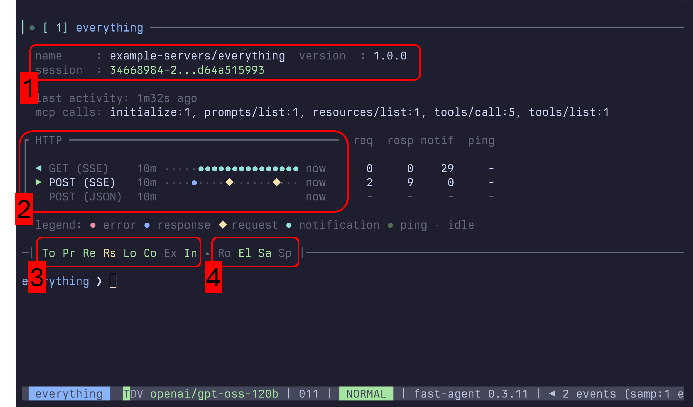

---
social:
  title: MCP Display
  tagline: Control how MCP tool calls, resources, and messages appear in the terminal.
  description: Control how MCP tool calls, resources, and messages appear in the terminal.
  alt: fast-agent social card — MCP Display
---


Detailed information about the MCP Server connection can be displayed with the `/mcp` command.



### Section 1 - Implementation, Protocol, and Session

This section shows the server implementation, negotiated protocol version and
era, and subscription state. For legacy Streamable HTTP servers it also shows a
real `Mcp-Session-Id` when one was observed. Modern `2026-07-28` connections are
shown as sessionless. The `local` value for stdio describes transport locality,
not a protocol session.

### Section 2 - Transport Channel History

Shows transport activity only when fast-agent has a live diagnostics source.
The current SDK v2 integration records stdio connection and operation activity.
It does not expose the exact Streamable HTTP POST JSON/SSE response split, GET
stream, or resumption counters that older fast-agent transport forks collected,
so those remote channel rows are omitted rather than inferred.

### Section 3 - Server Capabilities

- `To`, `Pr`, `Re`: Tools, Prompts and Resources. Green for available, Yellow for List Change notifications.
- `Rs`: Resource Subscriptions.
- `Lo`, `Co`: Logging and Completions.
- `Ex`: Experimental Capabilities
- `In`: Instructions. Green for available, and used - Yellow for available but not in Prompt, Red for available, but disabled.

### Section 4 - Client Capabilities.

- `Ro`: Roots offered to MCP Server.
- `El`: Elicitation offered to MCP Server. Red for `Cancel All` mode.
- `Sa`: Sampling offered to MCP Server. Green for auto, Yellow for manually configured.
- `Sp`: MCP Client Name has been spoofed.

### Configuration

When a transport activity timeline is available, it can be tailored in
`fast-agent.yaml` via the `mcp_timeline` block:

```yaml
mcp_timeline:
  steps: 20         # number of buckets rendered on the timeline
  step_seconds: 30  # duration of each bucket (supports values like "45s" or "2m")
```

These values flow through to both `fast-agent check` and the in-session `/mcp` display. When multiple events occur in the same bucket, higher priority states replace lower ones using this order: `error` → `disabled/request` → `response` → `notification/ping` → `none`. This keeps significant events (such as errors and requests) visible even if a subsequent ping lands in the same interval.
