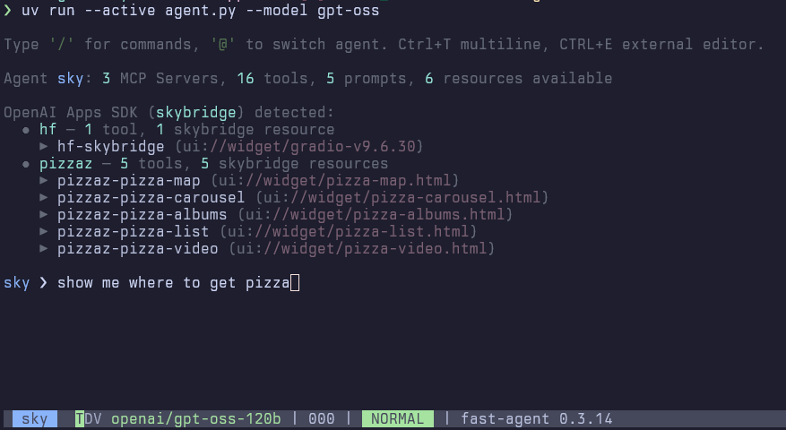
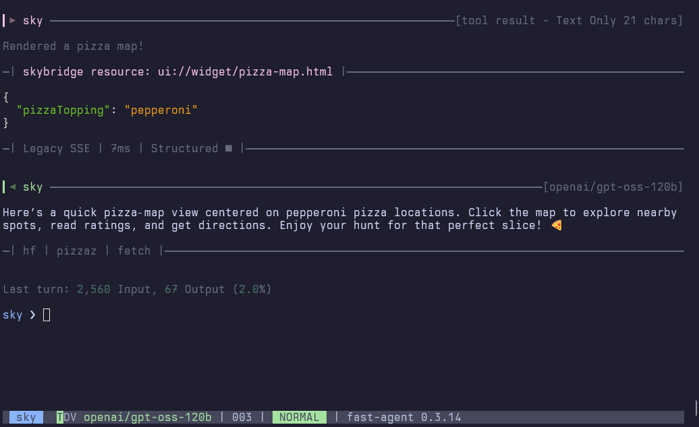

## Overview

**`fast-agent`** automatically detects
[OpenAI Apps SDK](https://developers.openai.com/apps-sdk) integrations exposed
by MCP servers. Detection runs during tool and resource discovery.

OpenAI Apps SDK tools publish:

```text
_meta["openai/outputTemplate"]
```

The value identifies a corresponding `ui://…` resource. The Apps SDK retains
the historical wire MIME type `text/html+skybridge`; fast-agent preserves that
literal for compatibility but uses **OpenAI Apps SDK** in its Python APIs,
diagnostics, and documentation.

## What `fast-agent` checks

- **Template metadata** – verifies that tool `_meta["openai/outputTemplate"]` values are valid URIs. Invalid entries raise warnings so they are easy to spot.
- **Resource availability** – ensures the referenced `ui://` resource exists. Missing resources generate warnings and keep the tool flagged as invalid.
- **MIME-type validation** – confirms the resource exposes `text/html+skybridge`. Non-matching MIME types surface warnings and prevent the tool from being enabled.
- **Unpaired resources** – highlights confirmed Apps SDK resources that no tool references, so server authors can wire them up.

Warnings are captured in `AppServerConfig.warnings`.

## Console Summary

After discovery, the console displays a concise app-integration summary:

- Lists servers with OpenAI Apps SDK signals, including enabled tools and valid resources.
- Surfaces aggregated warnings (such as invalid MIME types or missing references).
- Provides quick feedback about potential configuration issues before any tool runs.



## Tool Call Display

When an Apps SDK tool returns structured content, the tool result view adds a
separator that references the linked `ui://` resource. This identifies the
HTML payload expected to render in the OpenAI client.



## Programmatic access

Developers can inspect discovered configurations at runtime:

```python
configs = await agent.aggregator.get_app_integration_configs()
hf_config = await agent.aggregator.get_app_integration_config("huggingface")
```

Each `AppServerConfig` contains resources, tools, and warnings. OpenAI Apps SDK
entries have `kind == AppIntegrationKind.OPENAI_APPS_SDK`.

## Feature Gating / Client Spoofing

Some MCP servers gate Apps SDK resources based on the connecting client’s
implementation string. Configure a custom `implementation.name` and
`implementation.version` as described in
[Implementation Spoofing](client-servers.md#implementation-spoofing).

Fast-agent validates and describes Apps SDK resources; it does not host the
OpenAI iframe runtime in the terminal.
