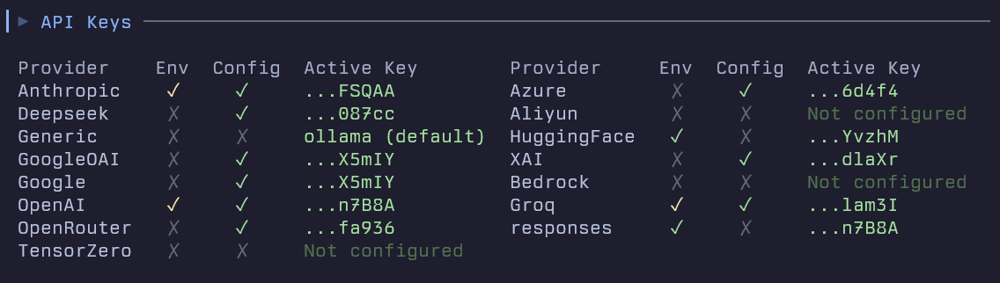

---
social:
  title: LLM Providers
  tagline: Configure providers, authentication, and model aliases for fast-agent.
  description: Configure providers, authentication, and model aliases for fast-agent.
  alt: fast-agent social card — LLM Providers
---


For each model provider, you can configure parameters either through environment variables or in your `fast-agent.yaml` file.

Be sure to run `fast-agent check` to troubleshoot API Key issues:



## Common Configuration Format

In your `fast-agent.yaml`:

```yaml
<provider>:
  api_key: "your_api_key" # Override with API_KEY env var
  base_url: "https://api.example.com" # Base URL for API calls
  default_headers: # Optional - custom headers for all API requests
    X-Custom-Header: "value"
```

The `default_headers` option is available for OpenAI-compatible providers (including Azure).


## Provider quick reference

| Provider | Config key | API key environment variable | Notes |
| --- | --- | --- | --- |
| OpenAI Responses | `responses` | `OPENAI_API_KEY` | Native Responses API, reasoning, web search, connectors, remote MCP |
| OpenAI Chat Completions | `openai` | `OPENAI_API_KEY` | OpenAI-compatible Chat Completions models |
| Codex Responses | `codexresponses` | `fast-agent auth codexplan` or `CODEX_API_KEY` | Codex subscription-backed Responses models; no provider-managed MCP/connectors |
| Anthropic | `anthropic` | `ANTHROPIC_API_KEY` | Claude Messages API, prompt caching, web tools |
| Google | `google` | `GOOGLE_API_KEY` | Native Gemini API |
| Azure OpenAI | `azure` | `AZURE_OPENAI_API_KEY` | Azure deployments and optional DefaultAzureCredential |
| Bedrock | `bedrock` | AWS credentials | Amazon Bedrock models |
| Groq | `groq` | `GROQ_API_KEY` | Additional provider; OpenAI-compatible hosted inference |
| xAI / Grok | `xai` | `XAI_API_KEY` | Grok models, reasoning, web search, and X Search |
| DeepSeek | `deepseek` | `DEEPSEEK_API_KEY` | Additional provider; OpenAI-format API |
| Aliyun | `aliyun` | `ALIYUN_API_KEY` | Additional provider; DashScope compatible-mode endpoint |
| OpenRouter | `openrouter` | `OPENROUTER_API_KEY` | Additional provider; routed upstream models |
| Hugging Face | `hf` or `huggingface` | `HF_TOKEN` | Inference Providers router and HF MCP auth |
| Open Responses | `openresponses` | `OPENRESPONSES_API_KEY` | Additional provider; interoperable Open Responses endpoints |
| Generic | `generic` | `GENERIC_API_KEY` | Additional provider; local/self-hosted OpenAI-compatible endpoints |
| TensorZero | `tensorzero` | None | Additional provider; local TensorZero Gateway functions |

See [Additional Providers](providers/additional/) for the long-tail reference with config keys, API key names, default endpoints, model string examples, and provider-specific notes.

## Detailed provider guides

- [OpenAI](providers/openai/) for Responses, Chat Completions, Codex Responses, web tools, connectors, and transport options.
- [Anthropic](providers/anthropic/) for Claude, prompt caching, reasoning, structured outputs, and Anthropic web tools.
- [Google](providers/google/) for native Gemini configuration and aliases.
- [Azure OpenAI](providers/azure/) for Azure deployments, authentication modes, and regional availability.
- [AWS Bedrock](providers/bedrock/) for Bedrock model IDs, AWS authentication, and capability caveats.
- [xAI / Grok](providers/xai/) for Grok models, reasoning, web search, and X Search.
- [Hugging Face](providers/huggingface/) for Inference Providers routing, curated aliases, and HF MCP authentication.
- [Additional Providers](providers/additional/) for Groq, DeepSeek, Aliyun, OpenRouter, Open Responses, TensorZero, and generic OpenAI-compatible endpoints.
