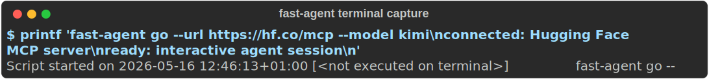

---
social:
  title: Docs Automation
  tagline: Generate reference docs, social cards, screenshots, and site builds.
  description: Generate reference docs, social cards, screenshots, and site builds.
  alt: fast-agent social card — Docs Automation
---

# Docs Automation

The docs live in this repository, so pages can include source examples directly and generated
content can be refreshed from the codebase.

## Current Flow

```bash
uv run scripts/docs.py generate
uv run scripts/docs.py assets
uv run scripts/docs.py social
uv run scripts/docs.py build
uv run scripts/docs.py screenshot
uv run scripts/docs.py assess
```

- `generate` refreshes `_generated/` from the Python source tree.
- `assets` verifies committed interactive docs assets, including vendored asciinema player files.
- `social` renders per-page Open Graph PNGs from HTML using `google-chrome`.
- `build` verifies the committed social PNGs exist, then runs a strict Zensical build.
- `screenshot` captures the built local site and the live site for visual comparison with
  `google-chrome`.
- `assess` runs deterministic screenshot checks for capture dimensions, blank or unstyled pages,
  the designed home-page header, and visible terminal areas.

## Terminal Captures

Use `scripts/docs_terminal_capture.py` to run a command and write a terminal-style SVG that can be
embedded in docs:

```bash
uv run scripts/docs_terminal_capture.py \
  --command "uvx fast-agent-mcp@latest --help" \
  --output docs/docs/ref/terminal-uvx.svg
```

The script uses a pseudo-terminal through `script(1)` when available, then renders the captured ANSI
output with Rich. This makes CLI examples reproducible while still looking close to what users see
in a terminal.

Example output:



## Interactive Terminal Assets

Use `scripts/docs_assets.py` through the docs wrapper for interactive asciinema casts:

```bash
uv run scripts/docs.py assets
uv run scripts/docs.py assets-record tui-shell
uv run scripts/docs.py cast-build tui-shell
uv run scripts/docs.py cast-build model-picker
uv run scripts/docs.py cast-build skills-direct-install
uv run scripts/docs.py cast-build skills-slash-commands
uv run scripts/docs.py cast-build skills-over-mcp
uv run scripts/docs.py cast-build hf-image-generation
uv run scripts/docs.py cast-check
```

The `tui-shell` scenario records `fast-agent` starting with shell access and a visible model
selection, sends a short prompt, then runs `! git status` from inside the TUI. Recording requires
`asciinema` and `tmux`; normal docs builds only need the committed `.cast` files and the vendored
player assets. `cast-build` is an alias for recording a named cast. `cast-check` verifies the
committed player support files, all embedded `.cast` references, and the internal recording index.
That index is committed at `docs/docs/assets/asciinema-index.json`; use it to review which terminal
recordings are present, where each one is embedded, the cast dimensions/timing, and the command that
regenerates it.
The `model-picker` scenario records `fast-agent go` opening the startup model picker, then navigates
the provider/model lists with arrow keys.
The skills scenarios record direct install and update-check flows from a temporary local git
repository, using either CLI commands or `/skills` slash commands in the TUI.
The `skills-over-mcp` scenario connects to `https://huggingface.co/mcp`, selects the `hf`
MCP-backed registry, searches the registry, and installs a SHA256-verified skill. Override
`FAST_AGENT_SKILLS_MCP_DEMO_SERVER` to record against a local SEP-2640 server.
The `hf-image-generation` scenario records the Hugging Face dynamic Space flow with halfcell
terminal-image rendering so the generated image is captured as ordinary terminal cells. It is more
service-dependent than the other casts; use it when intentionally refreshing the image-viewer demo.

A2A recordings are managed by the A2A docs pipeline because the deterministic recordings share the
fake A2A server and generated snippets:

```bash
uv run scripts/a2a_docs_pipeline.py record
```

`record` refreshes the deterministic A2A casts as a batch and updates the shared asciinema index.

By default, cast recordings stop by killing the tmux session after the final demonstrated action,
so the user-facing recording does not show a trailing `/exit`. Set
`FAST_AGENT_TUI_DEMO_SHOW_EXIT=1` when you explicitly want the exit command included.
Cast recordings also set `TUI__COMPLETION_MENU_RESERVED_LINES=4` by default to keep the prompt
area compact; override it when a recording needs to demonstrate completion menus.
The recording driver sets `FAST_AGENT_HOME` to a temporary directory with a tiny config file so
project-local config, implicit cards, sessions, and permission-store state from the repository
`.fast-agent` are not loaded. It runs `fast-agent` from a throwaway demo git repository rather than
the docs checkout. It also unsets `ENVIRONMENT_DIR`, `FAST_AGENT_RUNTIME_ENVIRONMENT`, and
`VIRTUAL_ENV` to avoid environment overrides and `uv` active-environment warnings, and sets
`FAST_AGENT_KEYRING_NOTICE=0` so the one-time OS keyring probe message does not appear in committed
casts.

The default recording command is:

```bash
fast-agent -x --model deepseek
```

Override it for local refreshes with:

```bash
FAST_AGENT_TUI_DEMO_MODEL=sonnet uv run scripts/docs.py assets-record tui-shell
FAST_AGENT_TUI_DEMO_COMMAND="fast-agent -x --model deepseek" uv run scripts/docs.py assets-record tui-shell
```

For image-output refreshes, prefer a small halfcell render and a landscape prompt with broad shapes:

```bash
uv run scripts/docs.py cast-build hf-image-generation
```

Override `FAST_AGENT_HF_IMAGE_DEMO_COMMAND`, `FAST_AGENT_HF_IMAGE_DEMO_PROMPT`,
`FAST_AGENT_HF_IMAGE_DEMO_RESPONSE_WAIT`, or the `LOGGER__TERMINAL_IMAGES__WIDTH`/`HEIGHT`
environment variables when the service or model needs a different prompt, timing, or image size.

## Social Cards

Every Markdown page gets a committed 1200×630 PNG under `docs/assets/social/`. `overrides/main.html`
points Open Graph and Twitter metadata at those page-specific images.

Regenerate cards locally after adding or renaming docs pages:

```bash
uv run scripts/docs.py social
```

The script renders a designed HTML card with `google-chrome`, then optimizes the PNG. The normal
docs build does not require Chrome; it only fails if an expected image is missing, which catches
Cloudflare Pages builds where a new page was committed without its card.

## Visual Assessment

`scripts/docs_visual_assess.py` adapts the screenshot QA pattern used by the visual inspection tools
in `/home/ssmith/temp/html-agent-dev`: deterministic checks run first, and an optional vision judge
can inspect the same screenshots with a docs-specific rubric.

```bash
# Run deterministic checks only
uv run scripts/docs.py assess

# Write the vision prompt/card without calling a model
uv run scripts/docs_visual_assess.py --dry-run

# Run the vision judge when credentials are available
uv run scripts/docs_visual_assess.py --vision --model gpt-5.5
```

The deterministic path is intended for routine local and CI use. The vision path adds checks that
pixel metrics cannot reliably catch: literal Markdown artifacts, overlapping labels, awkward mobile
wrapping, weak feature copy, and whether CLI examples read like real terminal output.

## Source-Backed Includes

`pymdownx.snippets` is configured with both `docs/docs` and the repository root. Documentation
pages can include examples directly from `examples/`:

```markdown
--8<-- "examples/workflows/parallel.py"
```

Prefer direct includes for examples that are meant to stay runnable. This keeps docs and examples
on one source of truth and makes drift visible in ordinary code review.

## Source-Backed Configuration

For defaults that appear in code, docs, and sample config, keep the Pydantic settings model as the
authority and generate reusable snippets. `docs/generate_reference_docs.py` writes compaction
snippets from `fast_agent.config.CompactionSettings`; docs pages include those snippets instead of
copying values such as `compaction.threshold` by hand.

The annotated setup template lives at `examples/setup/fast-agent.yaml`, and the packaged setup
resource is copied from that path during build. When a setup value mirrors a code default, add or
update a focused test that parses the setup template and compares that value with the corresponding
settings model.

## Plugin API Reference

`docs/generate_plugin_api_docs.py` reads the plugin command dataclasses and runtime protocol from
`src/fast_agent/command_actions/`, writes `_generated/plugin_api.md`, and the plugins guide includes
that snippet. This keeps handler signatures, context fields, result fields, and runtime methods
aligned with the implementation.

## Proposed Next Automations

- Add a CI docs job that runs `uv run scripts/docs.py generate`, fails if generated files changed,
  then runs `uv run scripts/docs.py build` and `uv run scripts/docs.py assess`.
- Add a snippet verifier that scans docs for `--8<--` includes and confirms every referenced file
  exists under an allowed root.
- Add example smoke tests for docs-included examples so pages cannot point at broken sample code.
- Store baseline screenshots for the home page and provider docs page, then compare new Chrome
  screenshots in CI with a small pixel-difference threshold.
