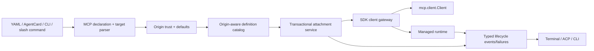

# MCP Configuration Refactor and Migration Plan

## Status

Implemented on `dev/0.10.0`.

This plan changes MCP configuration, ownership, error handling, and user-facing
connection boundaries. It preserves the current protocol-mode product behavior
while simplifying the integration around the stable-v2 SDK.

## Decision summary

1. Keep `mcp.servers` as the only persisted central server collection.
2. Keep `mcp.servers.<name>.target` as shorthand alongside expanded server
   definitions.
3. Remove `mcp.targets`; do not retain two collections with implicit
   precedence.
4. Treat the `mcp.servers` map key as the server's sole identity.
5. Reject shorthand entries that also specify a competing connection source.
6. Make `mcp` a real namespace for MCP defaults, client policy, and
   diagnostics.
7. Separate reusable server definitions from live agent attachments.
8. Track whether a definition came from central config, an AgentCard, or a
   runtime command instead of mutating loaded settings.
9. Use a shared declaration model for central config and AgentCards, while
   applying AgentCard trust policy separately.
10. Validate the work through a small set of end-to-end configuration and
    runtime scenarios, not parallel collections of normalization micro-tests.
11. Use one SDK client gateway for persistent and request-scoped connections,
    including one OAuth escalation policy.
12. Preserve typed SDK/HTTP failures until recovery has been decided; render
    user guidance only at the command/UI boundary.
13. Make attachment transactional: a failed connection never publishes a
    definition, mutates loaded settings, or damages an existing attachment.
14. Normalize startup `--url`/`--npx`/`--uvx`/`--stdio`, terminal `/connect`,
    `/mcp connect`, and ACP through one target grammar and materializer.

## Why change the current model

The current configuration accepts both:

```yaml
mcp:
  targets:
    - name: docs
      target: "https://example.com/mcp"

  servers:
    filesystem:
      command: npx
      args: ["-y", "@modelcontextprotocol/server-filesystem", "."]
```

`mcp.targets` and `mcp.servers.<name>.target` describe the same concept through
different collection shapes. This causes several problems:

- the list form has weaker layered-config and secrets merge behavior;
- durable names may be inferred from targets instead of being explicit map
  identities;
- `mcp.servers` silently wins when both collections resolve to the same name;
- schema and editor tooling cannot describe arbitrary list-derived keys well;
- normalization immediately discards the user's shorthand source form;
- runtime code cannot reliably explain where a definition came from;
- AgentCards use another, narrower declaration model and then promote entries
  into a process-global registry.

The nesting under `mcp` remains worthwhile only if it becomes a coherent MCP
policy namespace rather than a wrapper around two competing server lists.

## Verified runtime and error-handling findings

The configuration review was followed by a direct audit of the stable-v2 MCP
runtime, command handlers, CLI adapters, and focused tests. The following are
current implementation facts, not hypothetical concerns.

### What is already well-factored

- `MCPClientConnection` composes the public `mcp.client.Client` rather than
  reimplementing negotiation, discovery/adoption, MRTR, cache behavior, or
  ordinary protocol requests.
- Modern subscriptions use the SDK's public `Client.listen()` and
  `SubscriptionLost`.
- URL elicitation and the directory-read extension are isolated additions on
  top of the SDK client.
- Stdio startup diagnostics retain bounded recent stderr and distinguish common
  executable/cwd failures.
- Runtime connect already has useful OAuth progress events, cancellation
  behavior, auth redaction, and structured command outcomes.
- `protocol_mode` maps cleanly to SDK modes; modern request resumption remains
  SDK-owned.

These seams should be retained. The refactor should remove duplication around
them, not replace them.

### Correctness issue: legacy session termination is not recognized

`ServerSessionTerminatedError.SESSION_TERMINATED_CODE` is currently `32600`.
Stable MCP v2 emits the public `mcp_types.INVALID_REQUEST` value, `-32600`, with
message `Session terminated` when a legacy Streamable HTTP session receives the
relevant 404.

The current comparison in
`src/fast_agent/mcp/client_connection.py:MCPClientConnection._interactive_operation`
therefore cannot recognize the stable-v2 error. Automatic legacy session
replacement is bypassed even when `reconnect_on_disconnect` is enabled.

The correction must:

- import the public SDK/types constant rather than copy its numeric value;
- match both the code and the SDK session-termination message so unrelated
  invalid requests are not treated as disconnects;
- apply only to the legacy protocol path;
- prove one replacement and at most one safe replay with a real HTTP simulator.

This is an immediate correctness patch, independent of configuration migration.

### Recovery is classified too late

`MCPAggregator._execute_session_method` catches nearly every exception and may
convert it through `error_factory` before `_execute_on_server` can classify
OAuth, transport, or session recovery. The outer recovery policy therefore sees
some infrastructure failures but receives ordinary result objects for others.

Recovery must operate on the original typed failure before any agent-facing
`CallToolResult(is_error=True)` or other fallback result is created.

Server-declared tool errors remain ordinary MCP results. Infrastructure errors
remain exceptions through the final permitted recovery attempt, and only the
terminal boundary converts them when the calling API requires a result.

### Error classification relies on flattened text

Current startup and command paths classify some failures using strings such as
`"401 unauthorized"`, `"oauth"`, `"timeout"`, and registration-404 phrases:

```text
MCPConnectionManager._is_http_auth_challenge_error
MCPConnectionManager._is_oauth_timeout_message
commands.handlers.mcp_runtime._classify_connect_failure
```

This is fragile after exception groups and traceback formatting have erased
types. A single recursive exception walker should inspect:

- `HTTPStatusError.response.status_code` and headers;
- `MCPError.code`, message, and data;
- known OAuth exception types;
- `ExceptionGroup` members and `__cause__`/`__context__`.

String matching remains only a compatibility fallback for third-party
exceptions that expose no structured signal. It must not be the primary source
of retry decisions.

### OAuth attempt ownership is duplicated

Persistent initialization in `MCPConnectionManager`, temporary initialization
in `ServerRegistry.initialize_server`, and operation recovery in
`MCPAggregator` each own part of auto-OAuth escalation.

This makes it difficult to prove that:

- the first auto attempt is credential-free;
- only a genuine HTTP authentication challenge enables OAuth;
- escalation happens at most once;
- explicit auth headers remain authoritative;
- probe and persistent behavior are identical.

OAuth transport/provider behavior should continue to use the SDK provider.
Fast-agent should own exactly one connection-attempt policy around that SDK
provider.

### Teardown is signal-based rather than completion-based

`MCPConnectionManager.disconnect_server()` removes the runtime from
`running_servers`, sets its shutdown event, and returns before the lifecycle
task has exited. Reconnect and manager shutdown compensate with fixed
`asyncio.sleep(0.1)` and `asyncio.sleep(0.5)` delays.

This permits overlap between old and replacement clients and makes cleanup
timing dependent on the host. Each managed runtime needs a completion signal.
Disconnect must await SDK client, transport, process/HTTP client, callbacks, and
lifecycle-task completion before reporting success. Reconnect starts only
after that barrier; no correctness path uses a fixed sleep.

Unexpected shutdown failures should remain observable. Manager `__aexit__`
must not broadly swallow them after logging.

### Registry mutation makes attachment non-atomic

`ServerRegistry.registry` aliases `Settings.mcp.servers` directly.
`get_server_config()` mutates the selected model to fill `name`.
`MCPAggregator._resolve_attach_server_config()` inserts ad-hoc settings and
persists attachment-local reconnect overrides before connection and discovery
succeed.

Consequences:

- a failed `/connect` can leave a configured-looking registry entry;
- a reconnect override can change later attachments;
- card/runtime publication mutates loaded central settings;
- an existing same-name entry can be replaced before the replacement is known
  to work.

Declarations must be immutable inputs. A runtime definition and attachment are
published together only after successful connection/discovery, or staged in a
transaction that can be rolled back without reconstructing prior maps.

### Core runtime prints directly to the terminal

Aggregator recovery methods import `fast_agent.ui.console` and print reconnect,
authorization, and failure text. That couples MCP semantics to one surface and
causes terminal, ACP, and startup behavior to diverge.

The runtime should emit typed lifecycle/progress events. Terminal, ACP, and CLI
adapters render the same event and failure data for their medium.

### Ad-hoc surfaces do not share one grammar

Startup `--url` uses `cli.commands.url_parser` and startup stdio flags use
`cli.runtime.request_builders`; `/mcp connect` and terminal `/connect` use
`mcp.connect_targets`.

Observed differences include:

- malformed startup stdio input is printed and skipped instead of failing the
  requested run;
- `/mcp connect docs` changes meaning depending on current registry contents;
- terminal `/connect` is an alias, but ACP does not expose it;
- help omits accepted options such as `--protocol` in some places;
- status command meaning differs across terminal and ACP;
- generic initialization guidance says `Check fast-agent.yaml?` even for an
  ad-hoc URL or command;
- URL normalization silently appends `/mcp` when the supplied URL does not end
  in `/mcp` or `/sse`.

All public adapters should produce the same source-aware connect request and
consume the same structured outcome.

## Target runtime architecture



### Module responsibilities

#### Declaration parser/materializer

- preserves source form;
- parses a target once;
- validates source exclusivity;
- applies defaults and origin-specific trust;
- produces immutable effective `MCPServerSettings`;
- has no registry, SDK, lifecycle, or UI dependencies.

#### Definition catalog

- stores immutable declarations/effective settings with origin and owner;
- performs collision checks;
- does not open MCP clients;
- does not mutate `Settings`;
- does not track tools, prompts, or connection health.

`ServerRegistry.initialize_server()` moves out of this layer. The existing
`ServerRegistry` is either reduced to this responsibility or replaced by an
explicit `MCPServerCatalog`.

#### SDK client gateway

- is the only place that creates transport contexts and
  `MCPClientConnection`;
- uses public SDK `Client`, OAuth provider, exceptions, constants, and
  subscription APIs;
- owns one connection-attempt/OAuth-escalation policy for persistent and
  request-scoped clients;
- returns typed initialization metadata and preserves original exceptions;
- does not publish definitions or render user messages.

#### Runtime manager

- owns live SDK client/transport/process resources;
- has explicit `starting`, `ready`, `stopping`, and `completed` lifecycle
  barriers;
- guarantees one runtime per attachment identity;
- awaits teardown before replacement;
- leaves modern request resumption and protocol negotiation to the SDK.

Legacy keepalive remains fast-agent policy only where the SDK has no equivalent
durable behavior. It is not run for modern clients.

#### Attachment service

- resolves a catalog definition or stages an ad-hoc definition;
- applies attachment-local policy without rewriting the definition;
- opens and discovers through the gateway/runtime manager;
- atomically publishes the live attachment and resource indexes;
- rolls back every staged change on failure or cancellation;
- removes session-owned definitions when their final attachment is removed;
- retains central/card definitions after detach.

#### Failure and event boundary

Keep SDK and transport exceptions intact inside the gateway/runtime. At the
product boundary, normalize them once into a small immutable value:

```text
MCPFailure
  server_name           optional until naming/materialization succeeds
  origin                central | card | session
  surface               harness_startup | configured_attach | startup_url |
                        startup_stdio | terminal_connect | acp_connect
  input_ref             redacted target token or configuration path
  stage                 parse | auth | launch | initialize | discover |
                        operation | reconnect | shutdown
  kind                  invalid_input | unauthorized | oauth_failed |
                        timeout | protocol | session_lost | transport |
                        process | server | cancelled | internal
  summary
  detail
  retry                  never | user_action | safe_once
  remediation
  cause                  original exception, for logs/debugging only
```

Do not turn this into a second exception hierarchy mirroring every SDK type.
Classification is a boundary adapter; protocol detail continues to come from
the SDK.

Renderers consume `MCPFailure` and lifecycle events. They redact credentials and
choose terminal, Markdown/ACP, or CLI formatting without changing recovery
semantics.

### Recovery and replay policy

| Failure | Action |
| --- | --- |
| Invalid target/configuration | No retry; show the exact invalid path/token |
| Startup HTTP 401 in auto mode | Enable SDK OAuth provider and retry once |
| Explicit auth rejected | No OAuth override; report that supplied credentials were rejected |
| OAuth callback/registration failure | No automatic loop; preserve typed cause and next action |
| Legacy SDK `Session terminated` | Replace runtime once when enabled; replay only the rejected operation |
| Generic disconnect during list/read discovery | Reconnect once and replay |
| Generic disconnect/timeout during `tools/call` | Do not replay automatically; the tool may have run |
| `CallToolResult.is_error` | Return as server-declared result; no reconnect |
| Other `MCPError` | Preserve code/message/data; no retry unless explicitly classified |
| `SubscriptionLost` | Re-listen/refetch with bounded backoff; do not compete with SDK request resumption |
| Shutdown/cancellation | Await cleanup; do not start recovery |

The important invariant is that retry is decided by failure type and operation
replay safety, never by arbitrary text or a blanket `ConnectionError` catch.

## Canonical user surface

### Startup convenience

Retain the convenient existing forms:

```text
fast-agent --url https://example.com/mcp
fast-agent --url https://one.example/mcp --url https://two.example/mcp
fast-agent --npx "@modelcontextprotocol/server-filesystem ."
fast-agent --uvx "mcp-server-fetch"
fast-agent --stdio "python server.py --flag"
```

These become thin adapters over the same target parser and materializer used by
runtime connect. They must:

- fail the command when a requested target is malformed; never print-and-skip;
- report the inferred server name and resolved target;
- produce the same auth, naming, target, and transport semantics as `/connect`;
- make `--url` repeatable in input order, with comma-separated values accepted
  for one compatibility window;
- apply the existing startup `--auth` value to every startup URL and state that
  scope in help; use central config or separate runs when targets need different
  credentials;
- add `--mcp-protocol auto|modern|legacy` for startup ad-hoc targets rather than
  overloading an unrelated generic `--protocol`;
- parse every explicit startup target before attaching any of them;
- if an explicitly requested CLI target cannot attach, fail startup and clean
  up all CLI-owned attachments from that request rather than silently running
  without it;
- resolve inferred-name collisions deterministically by input order and report
  every selected name;
- use one redaction path for command output and logs.

Automatic `/mcp` URL suffixing is convenient but not obvious. During one
compatibility window, show the resolved URL and a deprecation notice whenever a
suffix is added. The canonical behavior then becomes using the exact URL the
user supplied. Users who want the common endpoint write `/mcp` explicitly.

### Runtime convenience

`/mcp connect` is the descriptive command and `/connect` is its universal
convenience alias in both terminal and ACP:

```text
/connect https://example.com/mcp
/connect --name preview --protocol modern https://example.com/mcp
/connect @modelcontextprotocol/server-filesystem .
/connect uvx mcp-server-fetch
/connect --name local -- python server.py --server-owned-flag
```

Canonical grammar:

```text
/connect [fast-agent options] <target>
/connect [fast-agent options] -- <stdio command> [arguments...]
```

Fast-agent options are:

```text
--name, --auth, --timeout, --protocol, --oauth, --no-oauth,
--reconnect, --no-reconnect
```

Options before the target are canonical. Existing accepted trailing forms may
remain compatible. `--` is required when a server-owned argument conflicts
with a fast-agent option.

Configured definitions use an explicit verb:

```text
/mcp attach docs
```

`/connect docs` always means an ad-hoc target/stdio command, regardless of
catalog contents. It never performs a registry lookup to decide grammar.

### Status and disconnect

Use:

```text
/mcp list
/mcp status
/mcp disconnect <attached-name>
/mcp reconnect <attached-name>
```

`/mcp` may remain a shortcut for `/mcp status`. `/mcpstatus` becomes a
warning-producing compatibility alias before removal.

Disconnect semantics are source-aware:

- central/card definition: remove the live attachment, retain the definition;
- runtime definition: remove the live attachment and session-owned definition;
- failed or cancelled connect: publish neither.

### User-facing failures

Every surface renders the same facts:

```text
Could not connect MCP server 'preview'.
Target: https://example.com/mcp
Stage: initialize
Cause: HTTP 401 Unauthorized
Next: authenticate with --auth, or retry with OAuth enabled.
```

Requirements:

- distinguish invalid input, auth, startup, protocol, server, timeout,
  cancellation, and reconnect failure;
- identify whether the source was configuration, an AgentCard, `--url`, or
  `/connect`;
- never suggest editing `fast-agent.yaml` for a runtime-only target;
- include command/cwd and bounded stderr for stdio startup failures;
- preserve MCP error code/message in details;
- never expose tokens, authorization headers, OAuth codes, URL credentials, or
  secret-derived environment values;
- emit one authorization link and one terminal outcome;
- provide `--debug`/logs with the original exception chain without changing the
  concise default message.

## Goals

- One central persisted collection with deterministic merge behavior.
- Concise configuration for common URL, package, and command targets.
- Expanded configuration when the source must be controlled explicitly.
- Actionable validation for ambiguous or obsolete input.
- Stable identity independent of target inference.
- Clear precedence between defaults, declarations, secrets, and runtime
  overrides.
- Explicit ownership and collision behavior across central config, AgentCards,
  and runtime connections.
- One SDK gateway and one OAuth escalation policy for every client lifetime.
- Typed, source-aware failures with bounded and operation-safe recovery.
- Transactional attachment and completion-based teardown.
- Identical target semantics across startup, terminal, and ACP adapters.
- Concise, actionable, redacted user errors.
- Source-preserving configuration inspection with secret redaction.
- A mechanical, idempotent migration path.
- Fewer tests, with more behavior exercised by each test.

## Non-goals

- Changing modern/legacy protocol negotiation or `protocol_mode` semantics.
- Replacing the official MCP client or FastMCP server integration.
- Restoring detailed HTTP transport diagnostics in this change.
- Moving every MCP-related UI setting merely because its name starts with
  `mcp_`.
- Redesigning agent configuration syntax in the first schema PR.
- Moving `load_on_start` to attachment policy in the first schema PR.
- Supporting a permanent compatibility parser for `mcp.targets`.

## Target central configuration

```yaml
mcp:
  defaults:
    protocol_mode: auto
    reconnect_on_disconnect: true
    include_instructions: true

  diagnostics:
    enabled: true
    timeline:
      steps: 20
      step_seconds: 30

  client:
    auto_sampling: true

  servers:
    huggingface:
      target: "https://huggingface.co/mcp"

    filesystem:
      target: "npx -y @modelcontextprotocol/server-filesystem ."
      protocol_mode: legacy

    private_docs:
      transport: http
      url: "https://docs.example.com/mcp"
      headers:
        X-Tenant: engineering

    provider_docs:
      management: provider
      url: "https://docs.example.com/mcp"
```

### MCP namespace

The initial namespace has these responsibilities:

| Path | Responsibility |
| --- | --- |
| `mcp.defaults` | Defaults for omitted per-server operational policy |
| `mcp.client` | Policy for capabilities implemented by the fast-agent MCP client |
| `mcp.diagnostics` | MCP diagnostic collection and presentation policy |
| `mcp.servers` | Reusable named server definitions |

The first migration moves:

```yaml
auto_sampling: true
mcp_timeline:
  steps: 20
  step_seconds: 30
```

to:

```yaml
mcp:
  client:
    auto_sampling: true
  diagnostics:
    enabled: true
    timeline:
      steps: 20
      step_seconds: 30
```

These paths must be consumed, not merely parsed. Existing sampling-mode
resolution reads `mcp.client.auto_sampling`, and existing timeline/status
rendering reads `mcp.diagnostics.timeline`. `mcp.diagnostics.enabled: false`
disables existing MCP activity diagnostic collection and presentation; it does
not disable ordinary connection status or imply the later HTTP instrumentation
work.

### Defaults

The first defaults model contains only settings with unambiguous cross-server
meaning:

```yaml
mcp:
  defaults:
    protocol_mode: auto
    reconnect_on_disconnect: true
    include_instructions: true
```

Resolution order is:

1. model defaults;
2. `mcp.defaults`;
3. the named server declaration;
4. a higher-precedence secrets/config layer for the same declaration;
5. an explicit runtime command override, when creating an ad-hoc connection.

An omitted field inherits the preceding layer. An explicitly supplied field,
including `false`, wins. Defaults are applied when a declaration is
materialized, not copied into source-form output.

AgentCard declarations use the same model in Phase 4. Central policy may supply
an omitted operational default, but it must not rewrite the card source or
bypass card trust restrictions.

## Server declaration forms

### Shorthand

The map-local `target` form is the concise source syntax:

```yaml
mcp:
  servers:
    docs:
      target: "https://example.com/mcp"
      protocol_mode: modern

    filesystem:
      target: "npx -y @modelcontextprotocol/server-filesystem ."
      env:
        LOG_LEVEL: warning
```

The map key supplies the name. Target parsing must never replace it with a name
inferred from the URL, package, or command.

### Expanded form

Expanded definitions remain canonical when explicit source control is needed:

```yaml
mcp:
  servers:
    docs:
      transport: http
      url: "https://example.com/mcp"
      http_timeout_seconds: 30

    filesystem:
      transport: stdio
      command: npx
      args:
        - -y
        - "@modelcontextprotocol/server-filesystem"
        - .
```

Expanded form also remains required for source types that cannot be expressed
unambiguously by `target`, such as a provider connector:

```yaml
mcp:
  servers:
    company_search:
      management: provider
      connector_id: company_search
      access_token: "${COMPANY_SEARCH_TOKEN}"
```

## Identity rules

For a central definition at `mcp.servers.<key>`:

- `<key>` is the local registry identity and tool namespace.
- A missing nested `name` is normal.
- A nested `name` equal to `<key>` may be read during migration, but canonical
  output omits it. This compatibility is warning-producing and is removed with
  the other temporary schema aliases after one minor release.
- A nested `name` different from `<key>` is rejected with an error naming both
  values and directing the user to rename the map key.
- Target-derived names are used only for ad-hoc runtime connections that lack
  `--name`; they never alter a persisted map identity.
- Duplicate names after layered config merge are one definition assembled by
  key. Definitions from different ownership domains do not silently override
  one another.

Use these terms consistently in errors, docs, and UI:

- **target**: a URL, package reference, or command string;
- **server name**: the local registry and tool-namespace identity;
- **configured server**: a reusable declaration;
- **attached server**: a live connection available to an agent.

Do not use **alias** in user-facing text unless a distinct alias feature is
introduced.

## Source exclusivity

An effective declaration has one connection source.

The source fields are:

- shorthand: `target`;
- expanded URL: `url`;
- expanded process: `command` with optional `args`;
- provider connector: `connector_id`.

`transport` is part of expanded source selection. When `target` is present, it
is inferred and is therefore also mutually exclusive with `target`.

The following is invalid:

```yaml
mcp:
  servers:
    docs:
      target: "https://example.com/mcp"
      transport: http
      url: "https://other.example.com/mcp"
```

The error should say that `target` cannot be combined with `transport` or
`url`, identify `mcp.servers.docs`, and suggest either shorthand or expanded
form.

`target` may be combined with settings that do not compete to locate the
server:

- metadata such as `description`;
- ownership such as `management`, where the resolved target is valid for that
  ownership mode;
- protocol selection;
- authentication, headers, and environment;
- timeouts, ping, reconnect, and lifecycle policy;
- roots;
- sampling and elicitation;
- instruction policy;
- process working directory;
- provider loading hints where supported.

After target expansion, the existing client-managed and provider-managed
invariants still apply. In particular:

- provider-managed definitions require exactly one URL or connector source;
- `connector_id` remains provider-only;
- provider-managed settings reject unsupported client transport options;
- forced modern protocol remains invalid over legacy SSE.

The new Phase 1 validation boundary is specifically that `target` cannot
coexist with an expanded source or `transport`. Existing expanded-form
cardinality and transport validators remain in force, but broadening or
tightening combinations that do not involve `target` is not a prerequisite for
this migration and must not be hidden inside normalization changes.

## Merge and precedence rules

### Layered files and secrets

`mcp.servers` is a map specifically so ordinary deep-merge rules work by
server name:

```yaml
# fast-agent.yaml
mcp:
  servers:
    docs:
      target: "https://example.com/mcp"
      protocol_mode: modern
```

```yaml
# fast-agent.secrets.yaml
mcp:
  servers:
    docs:
      access_token: "${DOCS_TOKEN}"
```

The merged `docs` declaration is validated once after layering. Secrets can add
authentication and other non-source fields. If a higher-precedence layer
introduces a second source field, validation rejects the effective declaration
rather than silently selecting one.

### Collection precedence

There is no precedence between `mcp.targets` and `mcp.servers` because
`mcp.targets` is removed. A file containing `mcp.targets` fails with a
migration-focused error.

### Ownership precedence

Central config, AgentCards, and runtime commands are separate ownership
domains, not precedence levels:

- one owner cannot silently replace another owner's definition;
- a collision reports both origins;
- runtime target replacement is an explicit disconnect followed by connect;
- reconnect refreshes the same definition and never changes ownership;
- reload removes or replaces only definitions owned by the reloaded source.

## Definitions and attachments

A server declaration answers:

> How can this server be reached and what connection policy applies?

An attachment answers:

> Which agent uses this declaration, and when should it be attached?

The long-term shape is:

```yaml
mcp:
  servers:
    docs:
      target: "https://example.com/mcp"

agents:
  researcher:
    mcp:
      - use: docs
        attach: eager
```

This syntax is directional, not part of Phase 1. Existing agent server lists
continue to identify configured servers. `load_on_start` also remains accepted
on server settings until attachment policy is redesigned. It should eventually
move to the agent/server relationship because eagerness is not an intrinsic
property of a reusable endpoint.

## Runtime command model

Phase 3 separates configured attachment from ad-hoc connection:

```text
/mcp attach docs
/mcp connect --name preview https://example.com/mcp
```

- `attach` accepts a configured catalog name.
- `connect` accepts a target and creates a runtime-owned definition.
- `connect` may infer a temporary name when `--name` is omitted, but reports
  the selected name before attachment.
- `/mcp connect docs` must not change meaning based on whether `docs` currently
  exists in the registry.
- disconnecting an attached configured server removes only its live
  attachment; its catalog definition remains available for another `attach`;
- disconnecting a runtime-owned server removes both its live attachment and
  session-owned catalog entry;
- `/mcp connect --name docs ...` is rejected while `docs` is owned by central
  config or a card;
- this refactor does not add in-place target replacement. Replace a runtime
  definition explicitly with `/mcp disconnect <name>` followed by
  `/connect --name <name> <new-target>`;
- `--reconnect` reconnects and refreshes the already attached definition. It
  does not change target ownership or replace its declaration.

There is no catalog-dependent compatibility interpretation for bare
`/mcp connect <configured-name>`. It is an ad-hoc target from the first release
of `/mcp attach`. The error for users who intended configuration points directly
to `/mcp attach <name>`.

## AgentCard model and ownership

`mcp_connect` remains useful for portable, card-owned dependencies:

```yaml
mcp_connect:
  docs:
    target: "https://example.com/mcp"
    protocol_mode: modern
```

The current implementation has two problems to correct:

1. it uses a narrower schema than central MCP declarations, including no
   `protocol_mode`;
2. it promotes card entries into a mutable process-global registry, so
   unrelated cards can conflict.

Phase 4 introduces a shared, source-preserving `MCPServerDeclaration` model for
central config and AgentCards. Connection materialization produces the existing
validated effective server settings.

AgentCard security remains a separate policy layer. Sharing a declaration
model does not imply that cards may use every field:

```text
source declaration
        |
        v
origin-specific trust validation
        |
        v
defaults + layered overrides
        |
        v
effective MCPServerSettings
```

Phase 4 does not silently broaden AgentCard authority. Its initial allowlist is
the currently supported card fields:

```text
target, name, description, management, connector_id, headers, access_token,
defer_loading, auth
```

plus `protocol_mode`. The shared declaration model supplies syntax and source
validation; the card-origin policy rejects all other declaration fields with an
origin-specific error. Any later addition—especially local process controls
such as `command`, `args`, `env`, or `cwd`—requires a separate trust review and
an explicit allowlist change. Existing card installation/trust approval remains
responsible for whether an accepted target may be activated; this refactor must
not bypass it.

Card definitions are internally namespaced by card identity and revision.
Their user-visible server name can remain concise within the owning agent.
Collisions are checked in the attachment scope where tool namespaces would
actually overlap, rather than globally across unrelated cards.

Reload behavior must be ownership-safe:

- reloading one card replaces only that card revision's declarations;
- removing a card disconnects only card-owned attachments no longer referenced;
- central definitions remain unchanged;
- runtime connections remain session-owned;
- conflicting replacement is rejected before disturbing a working attachment.

## Source and effective configuration

Configuration inspection needs two views.

### Source view

Preserves what the user declared:

```yaml
mcp:
  servers:
    docs:
      target: "https://example.com/mcp"
```

It must not expand the target or materialize inherited defaults.

### Effective view

Explains what the runtime will use:

```yaml
mcp:
  servers:
    docs:
      management: client
      transport: http
      url: "https://example.com/mcp"
      protocol_mode: auto
      reconnect_on_disconnect: true
      include_instructions: true
```

Both views redact access tokens, authorization headers, OAuth client secrets,
and secret-derived environment values. The effective view also reports
provenance for inherited values without exposing the contents of secret files.

Source preservation is implemented with the shared declaration model in
Phase 4. It should not be approximated by reconstructing shorthand from
effective settings because that cannot round-trip reliably.

## Migration examples

### `mcp.targets` list to named server map

Before:

```yaml
mcp:
  targets:
    - name: docs
      target: "https://example.com/mcp"
      protocol_mode: modern

    - name: filesystem
      target: "npx -y @modelcontextprotocol/server-filesystem ."
      load_on_start: false
```

After:

```yaml
mcp:
  servers:
    docs:
      target: "https://example.com/mcp"
      protocol_mode: modern

    filesystem:
      target: "npx -y @modelcontextprotocol/server-filesystem ."
      load_on_start: false
```

### String target with inferred name

Before:

```yaml
mcp:
  targets:
    - "https://huggingface.co/mcp"
```

After:

```yaml
mcp:
  servers:
    huggingface:
      target: "https://huggingface.co/mcp"
```

The migration tool uses the current inference algorithm once to select
`huggingface`, writes that result as an explicit key, and reports it. Users
should review inferred names before committing the migrated file.

### Existing expanded server

No source migration is required:

```yaml
mcp:
  servers:
    filesystem:
      transport: stdio
      command: npx
      args: ["-y", "@modelcontextprotocol/server-filesystem", "."]
```

### Moving global MCP policy

Before:

```yaml
auto_sampling: false
mcp_timeline:
  steps: 40
  step_seconds: 15
```

After:

```yaml
mcp:
  client:
    auto_sampling: false
  diagnostics:
    enabled: true
    timeline:
      steps: 40
      step_seconds: 15
```

## Compatibility and migration tooling

### `mcp.targets`

`mcp.targets` receives no silent dual-read period in the new schema. Continuing
to merge it with `mcp.servers` would preserve the ambiguity this change is
intended to remove.

The loader rejects it with:

- the source path;
- a concise before/after example;
- the migration command;
- explicit notice when both collections are present;
- collision details when entries would resolve to an existing map key.

### Moved global settings

The independent top-level `auto_sampling` and `mcp_timeline` settings may be
read for one minor compatibility window because they do not create collection
merge ambiguity:

- old-only input emits one deprecation warning and maps to the new path;
- new-only input is canonical;
- old and new paths together are rejected rather than assigned precedence;
- generated config, examples, and docs contain only the new paths;
- the aliases are removed after the announced window.

### Migration command

Phase 1 adds a raw-YAML migration entry point:

```text
fast-agent config migrate-mcp fast-agent.yaml
fast-agent config migrate-mcp fast-agent.yaml --write
```

It must run before normal settings validation so obsolete configuration does
not prevent migration. It should use round-trip YAML support to retain comments,
ordering, quoting, and unrelated content.

The command:

1. converts each `mcp.targets` item to `mcp.servers.<name>`;
2. uses an explicit list-entry `name`, or reports a currently inferred name;
3. refuses conflicting duplicate names instead of choosing a winner;
4. moves `auto_sampling` and `mcp_timeline` when the new paths are absent;
5. refuses old/new path conflicts and explains the required manual choice;
6. redacts secret values in console output;
7. defaults to a diff/dry run;
8. writes atomically with a backup only when `--write` is supplied;
9. is idempotent: running it again produces no diff and exits successfully.

The migration command is a Phase 1 requirement. Use round-trip YAML support;
do not implement a lossy PyYAML rewrite merely to meet the command name.

## Phased implementation

### Phase 0 / PR 0: stable-v2 correctness

Purpose: correct verified failure/reconnect behavior before moving ownership
boundaries.

Implementation:

- recognize the SDK's legacy session-termination error with public
  `mcp_types.INVALID_REQUEST` plus the SDK message;
- classify recovery before `error_factory` conversion;
- define operation replay safety so generic tool-call disconnects are not
  automatically replayed;
- add lifecycle completion barriers and remove correctness sleeps from
  disconnect/reconnect/manager shutdown;
- preserve original exception causes through `ServerInitializationError` while
  retaining concise stdio diagnostics;
- replace direct aggregator console printing with lifecycle/progress events
  consumed by the existing surfaces.

Primary implementation areas:

```text
src/fast_agent/core/exceptions.py
src/fast_agent/mcp/client_connection.py
src/fast_agent/mcp/mcp_aggregator.py
src/fast_agent/mcp/mcp_connection_manager.py
```

Exit criteria:

- the stable-v2 legacy session-termination signal reaches bounded reconnect;
- generic ambiguous tool-call failure is never replayed automatically;
- disconnect returns only after the old runtime completes;
- reconnect has no old/new runtime overlap and uses no fixed cleanup delay;
- terminal and ACP receive the same recovery events without MCP runtime modules
  importing terminal UI modules.

### Phase 1 / PR 1: persisted schema boundary

Purpose: establish one durable central schema without changing protocol
runtime behavior.

Implementation:

- add typed `defaults`, `client`, and `diagnostics` models under `MCPSettings`;
- move `auto_sampling` and `mcp_timeline` to their new canonical paths;
- update sampling and timeline consumers to read the new canonical paths;
- make `mcp.servers` the only persisted central collection;
- reject `mcp.targets` with an actionable migration error;
- retain `mcp.servers.<name>.target`;
- enforce map-key identity;
- enforce target/source exclusivity;
- apply defaults without losing explicit `false` values;
- update setup config, user docs, examples, integration fixtures, and generated
  reference material;
- add the migration guide and round-trip migration command;
- replace redundant normalization tests with the Phase 1 scenario contracts.

Primary implementation areas:

```text
src/fast_agent/config.py
src/fast_agent/mcp/connect_targets.py
examples/setup/fast-agent.yaml
docs/docs/mcp/client-servers.md
docs/docs/ref/config_file.md
examples/**/fast-agent.yaml
tests/integration/**/fastagent.config.yaml
```

Exit criteria:

- no maintained example or doc uses `mcp.targets`;
- obsolete input fails with a migration-focused error;
- sampling and existing timeline/status behavior consume the nested policy
  rather than falling back to stale top-level defaults;
- central shorthand and expanded forms build the same effective registry
  entries where semantically equivalent;
- no protocol-mode semantic changes are required except fixture paths.

### Phase 2 / PR 2: one SDK gateway and typed failures

Purpose: give persistent and request-scoped MCP clients one initialization,
OAuth, and failure boundary.

Implementation:

- introduce the SDK client gateway over `create_transport_context()` and
  `MCPClientConnection`;
- move temporary client initialization out of `ServerRegistry`;
- route persistent and request-scoped initialization through the gateway;
- centralize auto-OAuth attempt state and permit at most one escalation;
- recursively inspect typed exceptions and exception groups before text
  fallback;
- normalize terminal failures once into `MCPFailure`;
- retain original SDK/HTTP/OAuth causes for diagnostics;
- keep modern negotiation, discovery/adoption, MRTR, cache, subscriptions, and
  request resumption in the SDK.

Primary implementation areas:

```text
src/fast_agent/mcp/client_connection.py
src/fast_agent/mcp/mcp_connection_manager.py
src/fast_agent/mcp/gen_client.py
src/fast_agent/mcp_server_registry.py
src/fast_agent/mcp/http_errors.py
```

Exit criteria:

- one connection-attempt implementation serves probes and persistent runtimes;
- auto OAuth begins credential-free, escalates only on a typed challenge, and
  retries at most once;
- explicit auth is not silently replaced;
- startup, OAuth, protocol, timeout, and process failures retain structured
  classification and cause;
- `ServerRegistry` no longer creates SDK clients;
- no product retry depends primarily on flattened traceback text.

### Phase 3 / PR 3: transactional catalog, attachments, and user commands

Purpose: separate loaded declarations from mutable runtime attachment state.

Implementation:

- introduce a runtime catalog entry containing effective settings and origin
  metadata;
- model origin as central config, AgentCard, or runtime/session;
- stop inserting card/runtime definitions into loaded central settings;
- stage ad-hoc definitions until connection and discovery succeed;
- keep attachment-local overrides off catalog definitions;
- add `/mcp attach <configured-name>`;
- reserve `/mcp connect [--name NAME] <target>` for ad-hoc targets;
- expose `/connect` consistently in terminal and ACP;
- route startup `--url`, `--npx`, `--uvx`, and `--stdio` through the same target
  parser/materializer;
- make malformed startup targets fail rather than print-and-skip;
- standardize `/mcp list`, `/mcp status`, and source-aware error output;
- define explicit collision, reconnect, disconnect, and cleanup behavior;
- keep attachment lifecycle in the harness/registry path rather than command or
  UI adapters;
- update status output to show configured/attached state and origin.

Primary implementation areas:

```text
src/fast_agent/mcp_server_registry.py
src/fast_agent/mcp/mcp_aggregator.py
src/fast_agent/commands/handlers/mcp_runtime.py
src/fast_agent/core/agent_card_runtime.py
src/fast_agent/cli/runtime/request_builders.py
src/fast_agent/acp/slash/handlers/mcp.py
```

Exit criteria:

- attaching a configured server does not create or rewrite a declaration;
- disconnecting a configured attachment preserves its catalog declaration;
- ad-hoc connections are session-owned and cleaned up deterministically;
- failed/cancelled attach leaves no catalog entry or partial resource indexes;
- collisions identify both owners;
- runtime reconnect cannot overwrite central or card ownership;
- runtime command meaning is independent of current registry contents;
- startup, terminal, and ACP produce equivalent effective settings and
  equivalent failure kinds for the same target.

### Phase 4 / PR 4: shared declarations and AgentCard ownership

Purpose: remove schema drift and preserve source form.

Implementation:

- add a shared, source-preserving MCP declaration model;
- use it for central config and `mcp_connect`;
- materialize effective `MCPServerSettings` only after origin-specific trust
  checks and defaults;
- add AgentCard parity fields, including `protocol_mode`;
- retain the current AgentCard declaration allowlist plus `protocol_mode`,
  rejecting other shared-model fields until separately approved;
- namespace card declarations internally;
- scope collisions to actual attachment/tool-namespace overlap;
- implement source and effective config inspection with provenance and
  redaction;
- consolidate central and AgentCard parser/runtime tests around the shared
  contracts.

Primary implementation areas:

```text
src/fast_agent/agents/agent_types.py
src/fast_agent/core/agent_card_loader.py
src/fast_agent/core/agent_card_mcp_connect_validation.py
src/fast_agent/core/agent_card_rules.py
resources/shared/agent_cards.md
```

Exit criteria:

- central and card declarations accept the same syntax unless a documented
  trust rule forbids a field;
- card field acceptance matches the explicit origin allowlist and does not
  expand as a side effect of adding central configuration fields;
- source output round-trips shorthand;
- effective output explains defaults and origin while redacting secrets;
- unrelated cards no longer conflict through a process-global name alone.

### Later, separate work

- move `load_on_start` and similar eagerness policy to agent attachments;
- introduce the richer persisted `agents.<name>.mcp[].use/attach` syntax;
- remove temporary top-level setting aliases after the compatibility window;
- add broader source/effective config tooling outside MCP;
- restore detailed HTTP diagnostics through public SDK seams.

## Scenario-driven test plan

The refactor should be governed by seven scenario contracts. Each scenario may
contain several assertions, but it should enter through a real public boundary
and prove an externally meaningful invariant.

Phase gates:

| Scenario | First gate | Later extension |
| --- | --- | --- |
| 1. Persisted config/migration | Phase 1 through `get_settings` and the current registry | Phase 3 origin-aware catalog |
| 2. Declaration materialization | Phase 1 | Phase 2 gateway assertion for local/provider ownership |
| 3. Ad-hoc surface parity | Phase 3 | — |
| 4. Transactional attachment | Phase 3 | — |
| 5. Auth/startup failure | Phase 2 gateway and typed failure assertions | Phase 3 surface parity and catalog rollback |
| 6. Session loss/replay/teardown | Phase 0 recovery and lifecycle assertions | Phase 2 shared-gateway path |
| 7. AgentCard/inspection | Phase 4 | — |

No test is deleted based on a later-phase assertion before that phase lands.

### 1. Persisted configuration, migration, and effective catalog

Use real project and secrets YAML files containing:

- named and unnamed legacy `mcp.targets`;
- an existing expanded server;
- target shorthand with operational siblings;
- nested MCP defaults/client/diagnostics policy;
- a secret-layer auth value and an explicit `false`;
- comments and unrelated provider settings.

Run the migration command, then load with `get_settings(...)` and construct the
real catalog.

Assert:

- the dry-run diff and write are correct;
- comments and unrelated settings survive;
- a second migration is a no-op;
- an unmigrated file receives the actionable rejection;
- conflicting inferred names refuse migration;
- map keys become immutable identities;
- secrets merge by key and explicit values beat defaults;
- nested sampling and timeline policy reaches existing consumers;
- no credential appears in migration, validation, or catalog status output.

This replaces separate tests for each shorthand sibling, default, and migration
helper.

### 2. Declaration validation and local/provider materialization

Load one valid fixture and a compact invalid-case table through the public
settings boundary.

The valid fixture contains:

- client-managed HTTP target shorthand;
- expanded stdio;
- provider-managed URL;
- provider-managed connector;
- shorthand auth, lifecycle, roots, sampling, elicitation, and instruction
  policy.

Invalid cases cover:

- nested `name` disagreeing with the map key;
- `target` plus `url`, `command`/`args`, or `transport`;
- provider connector plus another source;
- unsupported client/provider cross-mode fields;
- forced modern protocol over legacy SSE.

Assert path-specific errors, equivalent effective settings for semantically
equivalent shorthand/expanded client definitions, and that provider-managed
definitions reach provider conversion without opening a local MCP runtime.

Do not create one test per field or reproduce Pydantic's literal tables.

### 3. Ad-hoc surface parity

Run one healthy MCP simulator through:

1. `fast-agent --url <url>`;
2. repeated and compatibility comma-separated `--url` targets with colliding
   inferred names;
3. startup stdio convenience;
4. terminal `/connect <url>`;
5. terminal `/mcp connect <url>`;
6. ACP `/connect <url>`;
7. explicit package and `-- <stdio command>` forms.

Assert:

- every adapter produces equivalent effective settings and inferred names;
- repeated URLs preserve input order, receive deterministic unique names, and
  share the documented startup auth/protocol scope;
- one malformed explicit startup target prevents all startup attachment, and
  one attachment failure cleans up every CLI-owned attachment from that request;
- the server attaches once, exposes one namespaced tool, and that tool is
  callable;
- `--protocol`, auth, timeout, and `--` behavior are documented and consistent;
- malformed startup stdio fails the run instead of being skipped;
- the resolved URL is visible during the suffix compatibility window;
- `/connect docs` has identical parser meaning whether or not `docs` is in the
  catalog;
- terminal and ACP render the same semantic connected outcome.

One shared attach-surface fixture should drive these entries rather than six
parallel fake-manager suites.

### 4. Transactional attachment, ownership, and disconnect

With a configured server `docs` and a simulator:

1. `/mcp attach docs`;
2. connect a runtime-owned `preview`;
3. reject ad-hoc use of the central `docs` name;
4. force a new runtime connection/discovery failure;
5. cancel another connection during startup;
6. disconnect and reattach `docs`;
7. disconnect `preview`.

Assert:

- loaded settings and catalog declarations are never mutated by attachment;
- attachment-local overrides do not affect later agents;
- failed/cancelled attempts publish no definition, tools, prompts, or
  capabilities;
- collision rejection never disturbs the existing working attachment;
- configured detach retains the definition;
- runtime detach removes the session-owned definition;
- target replacement requires explicit disconnect followed by connect.

This is the primary Phase 3 ownership contract.

### 5. Authentication, startup failure, and redaction

Use a stateful HTTP simulator and controlled stdio child:

- HTTP initializes with 401 plus `WWW-Authenticate`, then succeeds with OAuth;
- explicit bearer auth is rejected;
- OAuth registration returns 404;
- OAuth callback times out or is cancelled;
- executable is missing;
- cwd is invalid;
- child emits stderr and exits before initialize;
- protocol initialization is rejected.

Exercise at least startup `--url`, terminal `/connect`, and ACP `/connect`.

Assert:

- auto OAuth starts credential-free and escalates exactly once;
- explicit auth is never silently replaced;
- persistent and request-scoped attempts behave identically;
- each terminal failure has the correct origin, invocation surface, stage,
  kind, cause, and remediation;
- failed startup leaves no runtime/catalog residue;
- stdio errors include command, cwd, OS cause, and bounded stderr;
- terminal, ACP, logs, and progress never expose any credential;
- no ad-hoc error suggests editing `fast-agent.yaml`.

### 6. Session loss, operation errors, replay, and teardown

Use a stateful stable-v2 Streamable HTTP simulator that records requests,
session IDs, and call counts.

Exercise:

- legacy `MCPError(code=INVALID_REQUEST, message="Session terminated")`;
- unrelated invalid request;
- generic disconnect during `tools/list`;
- generic disconnect/timeout during `tools/call`;
- server `CallToolResult(is_error=True)`;
- modern request resumption/subscription loss;
- cancellation during disconnect and reconnect.

Assert:

- the legacy session signal is recognized with the SDK public constant;
- reconnect-disabled preserves the original failure;
- reconnect-enabled replaces the runtime once and performs only the permitted
  replay;
- unrelated invalid requests never reconnect;
- safe list/read operations may replay once;
- ambiguous tool calls never replay automatically;
- server-declared tool errors remain results;
- modern request resumption is not duplicated outside the SDK;
- disconnect awaits full completion and replacement never overlaps;
- no correctness assertion depends on a fixed sleep.

### 7. AgentCard ownership, reload, and configuration inspection

Load two real AgentCards plus central config through the harness:

- both cards use the same card-local name with different targets in unrelated
  attachment scopes;
- one card uses `protocol_mode`;
- one entry attempts a field outside the card trust allowlist;
- one collision occurs in an actual shared tool namespace;
- one card is reloaded and then removed.

Assert:

- unrelated card definitions are internally isolated;
- real namespace collisions report both origins before disturbing the working
  attachment;
- reload/removal affects only the card revision's declarations and runtimes;
- central and runtime-owned definitions remain unchanged;
- the trust allowlist accepts current fields plus `protocol_mode` and rejects
  unapproved process controls;
- source view retains shorthand;
- effective view reports defaults and provenance;
- both views redact credentials;
- source output reloads without semantic drift.

This becomes the Phase 4 gate for shared declarations and source preservation.

## Existing test consolidation

The following concentrated files currently overlap in target parsing,
normalization, AgentCard validation, and runtime behavior:

```text
tests/unit/fast_agent/test_config_mcp_target_shorthand.py
tests/unit/fast_agent/mcp/test_connect_targets.py
tests/unit/fast_agent/mcp/test_connect_targets_entry_resolution.py
tests/unit/fast_agent/core/test_agent_card_mcp_connect.py
tests/unit/fast_agent/commands/test_mcp_runtime_handlers.py
tests/unit/fast_agent/core/test_agent_card_validation.py
tests/unit/fast_agent/mcp/test_mcp_connection_manager.py
tests/unit/fast_agent/commands/test_url_parser.py
tests/unit/fast_agent/cli/commands/test_runtime_request_builders.py
tests/unit/fast_agent/ui/test_parse_mcp_commands.py
```

Consolidation rules:

- keep focused command-tokenization tests for genuine parser edge cases;
- keep OAuth and authorization behavior tests at their security boundary;
- keep provider payload tests for intentional provider contracts;
- keep modern/legacy protocol integration tests unchanged;
- retain a small pure test for typed failure classification, but replace
  phrase-matching retry tables with Scenarios 5 and 6;
- replace repeated target-to-settings mapping assertions with Scenarios 1 and
  2;
- replace separate startup URL/stdio and slash target mapping tables with the
  shared parser edge cases plus Scenario 3;
- replace command handler tests that manually assemble registry state with
  Scenario 4;
- replace separate AgentCard parsing, promotion, and collision micro-tests with
  Scenario 7 plus a small trust-policy validation table;
- retain focused pure display invariants, but derive one status/error rendering
  contract from live simulator transitions;
- remove tests that merely repeat Pydantic literal acceptance already exercised
  through loaded configuration;
- do not assert private normalization dictionaries or duplicate the target
  parser's implementation table in tests.

After the scenarios are in place, delete tests only when their behavior is
clearly covered. The expected result is approximately 25–35 fewer duplicated
micro-tests, not a target test-count reduction at the expense of parser,
security, ownership, or integration coverage.

## Validation for each PR

Every phase runs:

```text
uv run scripts/lint.py
uv run scripts/typecheck.py
```

Also run:

- the scenario contracts introduced by that phase;
- existing MCP protocol, auth, provider-managed, registry, and runtime command
  suites;
- docs generation/build when configuration reference material changes;
- package install smoke tests when bundled setup or shared AgentCard resources
  change.

Phase 1 should additionally scan maintained docs, examples, and fixtures for
obsolete `mcp.targets`, allowing only migration fixtures and historical release
notes.

## Rollout and rollback

Each phase is independently mergeable:

- Phase 0 fixes stable-v2 recovery and teardown without changing persisted
  configuration.
- Phase 1 changes persisted configuration but leaves runtime ownership intact.
- Phase 2 unifies SDK client creation and failures without changing catalog
  ownership.
- Phase 3 changes runtime ownership and commands using the Phase 1 settings and
  Phase 2 gateway.
- Phase 4 changes declaration preservation and AgentCard scoping without
  changing SDK transport behavior.

Rollback boundaries:

- if Phase 0 recovery changes regress, revert its replay/teardown slice while
  retaining the stable-v2 error-code correction and simulator regression test;
- if namespace migration causes regressions, revert Phase 1 as a unit and keep
  the migration command in dry-run-only mode;
- if the SDK gateway causes regressions, revert Phase 2 without restoring
  duplicated public error constants or text-based retry tests;
- if runtime ownership causes regressions, revert Phase 3 without restoring
  `mcp.targets`;
- if shared AgentCard declarations cause regressions, revert Phase 4 while
  retaining the explicit origin metadata from Phase 3.

Do not add a second silent precedence rule as a rollback mechanism. Temporary
compatibility must be explicit, warning-producing, and time-bounded.

## HTTP diagnostics were implemented separately

Detailed MCP HTTP diagnostics were restored after the configuration boundary
stabilized, without forking the MCP SDK, through:

1. supplied `httpx2.AsyncClient` request/response hooks for POST JSON versus
   POST SSE, GET activity, session IDs, and `Last-Event-ID`;
2. existing public SDK transport messages for logical request/response
   correlation where exposed.

Response bodies and streaming SSE events remain unconsumed by diagnostics.
The `mcp.diagnostics` namespace controls collection and timeline rendering
without coupling schema migration to transport instrumentation.

## Completion checklist

- [x] `mcp.servers` is the only persisted central server collection.
- [x] `mcp.servers.<name>.target` and expanded definitions are documented.
- [x] Map-key identity and source exclusivity are enforced.
- [x] MCP defaults, client policy, and diagnostics use typed namespace models.
- [x] Maintained setup, docs, examples, and fixtures use the new schema.
- [x] Obsolete input receives an actionable migration error.
- [x] Migration is mechanical and idempotent.
- [x] Stable-v2 session termination uses the SDK public constant and is covered
      by a simulator.
- [x] Recovery classification precedes result conversion and respects operation
      replay safety.
- [x] Persistent and request-scoped clients use one SDK/OAuth gateway.
- [x] Disconnect/reconnect awaits lifecycle completion without correctness
      sleeps.
- [x] Runtime catalog entries carry origin metadata.
- [x] Failed and cancelled attachment is atomic.
- [x] Configured attachment and ad-hoc connection are distinct commands.
- [x] Startup flags, terminal `/connect`, and ACP `/connect` share target
      semantics and structured outcomes.
- [x] MCP core emits events/failures rather than printing directly to terminal
      UI.
- [x] AgentCards share declaration syntax subject to separate trust policy.
- [x] Source and effective output preserve intent and redact credentials.
- [x] Seven scenario contracts cover the meaningful configuration and runtime
      behavior.
- [x] Redundant micro-tests are removed only after scenario coverage exists.
- [x] Lint, typecheck, focused MCP suites, docs build, and package smoke pass.
- [x] HTTP diagnostics restoration landed separately through public hooks.
